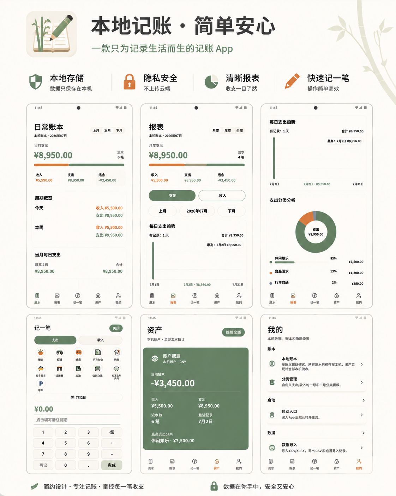

# 竹简

竹简是一款面向个人使用的 Android 离线记账 App。它把重点放在日常记账、数据查看和本地数据管理上，不做账号体系、云同步或在线服务，适合希望把账本留在自己手机里的用户。

## 特色

- 简约：界面围绕“流水、报表、记一笔、资产、我的”展开，入口清晰，减少不必要的干扰。
- 实用：支持支出、收入记录，分类管理，月度、年度和总计报表，本地资产概览。
- 隐私：APK 不申请联网权限，数据导入、导出和备份都通过 Android 系统文件选择器在本机完成。
- 安全：支持四位数字密码、系统生物识别、本地备份与加密备份，适合保存个人账本数据。

## 主要功能

- 手工记账：记录支出、收入、分类、时间和备注。
- 流水管理：查看、编辑、删除本地账单记录。
- 报表统计：按月度、年度、总计查看收支趋势和分类排行。
- 资产概览：以本地账户口径汇总收入、支出和余额。
- 数据导入：支持 CSV/XLSX 表格导入，导入前可预览，重复行会跳过。
- 数据导出：支持导出 CSV，便于用表格软件查看或二次整理。
- 本地备份：支持导出和恢复备份包，导入前会自动创建本机备份。
- 本地安全：支持本地锁和系统生物识别，降低他人直接查看账本的风险。

## 下载

当前版本 APK：

- 官方下载：[zhujian-rn-v1.4.7.apk](https://github.com/netkr/zhujian/releases/download/v1.4.7/zhujian-rn-v1.4.7.apk)
- 国内加速备用：[ghfast.top](https://ghfast.top/https://github.com/netkr/zhujian/releases/download/v1.4.7/zhujian-rn-v1.4.7.apk)

加速链接由第三方代理提供，仅用于公开 APK 下载。如果链接失效，请优先使用官方下载。

## 隐私说明

竹简的设计目标是本地优先：

- 不需要注册账号。
- 不申请 `android.permission.INTERNET`。
- 不上传账本数据。
- 不依赖云端同步。
- 导入、导出、备份、恢复均由用户主动选择本机文件完成。

请妥善保管自己的备份文件和备份密码。忘记本地数字密码或加密备份密码后，应用无法代为找回。

## 适用场景

- 想要一个简单、干净的个人记账工具。
- 不希望账本数据上传到云端。
- 需要从 CSV/XLSX 表格迁移历史账单。
- 希望能随时导出或备份自己的账本数据。

## 项目状态

当前公开仓库主要用于发布 APK 安装包和项目说明。
